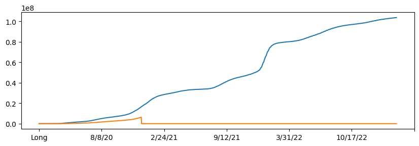
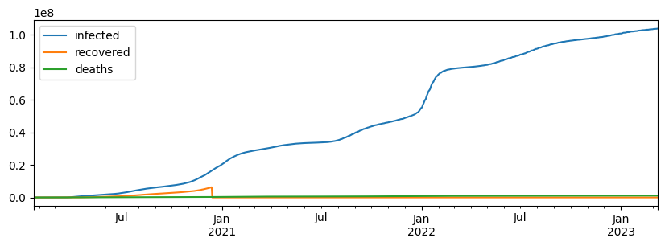
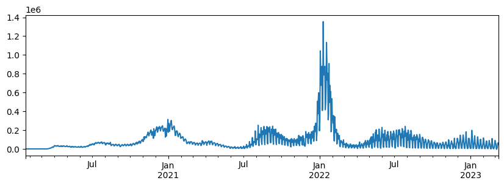
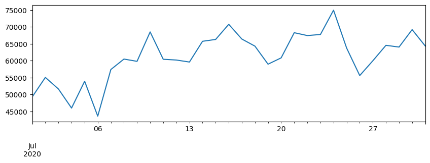
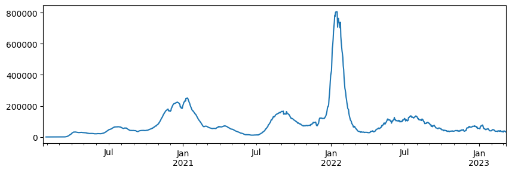
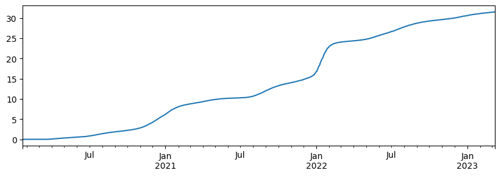
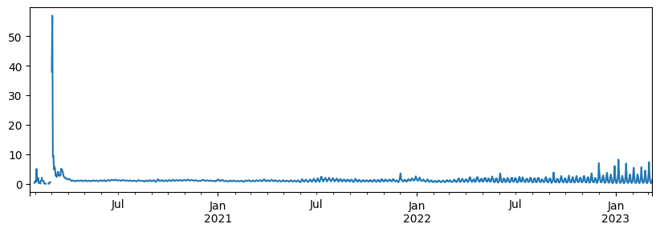
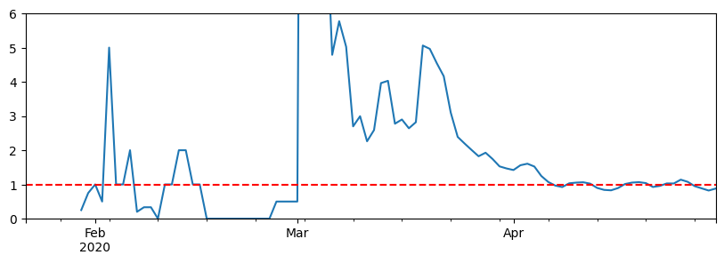
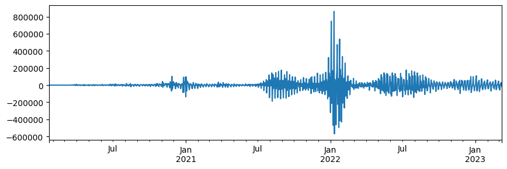
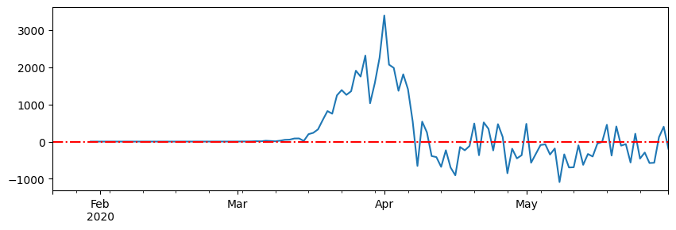

# Estimation of COVID-19 pandamic

## Loading Data


```python
import numpy as np
import pandas as pd
import matplotlib.pyplot as plt
plt.rcParams["figure.figsize"] = (10,3) # make figures larger
```

We can load the most recent data directly from GitHub using `pd.read_csv`. If for some reason the data is not available, you can always use the copy available locally in the `data` folder - just uncomment the line below that defines `base_url`:


```python
base_url = "https://raw.githubusercontent.com/CSSEGISandData/COVID-19/master/csse_covid_19_data/csse_covid_19_time_series/" # loading from Internet
# base_url = "../../data/COVID/" # loading from disk
infected_dataset_url = base_url + "time_series_covid19_confirmed_global.csv"
recovered_dataset_url = base_url + "time_series_covid19_recovered_global.csv"
deaths_dataset_url = base_url + "time_series_covid19_deaths_global.csv"
countries_dataset_url = base_url + "../UID_ISO_FIPS_LookUp_Table.csv"
```

Let's now load the data for infected individuals and see how the data looks like:


```python
infected = pd.read_csv(infected_dataset_url)
infected.head()
```


<div>
<style scoped>
    .dataframe tbody tr th:only-of-type {
        vertical-align: middle;
    }

    .dataframe tbody tr th {
        vertical-align: top;
    }

    .dataframe thead th {
        text-align: right;
    }
</style>
<table border="1" class="dataframe">
  <thead>
    <tr style="text-align: right;">
      <th></th>
      <th>Province/State</th>
      <th>Country/Region</th>
      <th>Lat</th>
      <th>Long</th>
      <th>1/22/20</th>
      <th>1/23/20</th>
      <th>1/24/20</th>
      <th>1/25/20</th>
      <th>1/26/20</th>
      <th>1/27/20</th>
      <th>...</th>
      <th>2/28/23</th>
      <th>3/1/23</th>
      <th>3/2/23</th>
      <th>3/3/23</th>
      <th>3/4/23</th>
      <th>3/5/23</th>
      <th>3/6/23</th>
      <th>3/7/23</th>
      <th>3/8/23</th>
      <th>3/9/23</th>
    </tr>
  </thead>
  <tbody>
    <tr>
      <th>0</th>
      <td>NaN</td>
      <td>Afghanistan</td>
      <td>33.93911</td>
      <td>67.709953</td>
      <td>0</td>
      <td>0</td>
      <td>0</td>
      <td>0</td>
      <td>0</td>
      <td>0</td>
      <td>...</td>
      <td>209322</td>
      <td>209340</td>
      <td>209358</td>
      <td>209362</td>
      <td>209369</td>
      <td>209390</td>
      <td>209406</td>
      <td>209436</td>
      <td>209451</td>
      <td>209451</td>
    </tr>
    <tr>
      <th>1</th>
      <td>NaN</td>
      <td>Albania</td>
      <td>41.15330</td>
      <td>20.168300</td>
      <td>0</td>
      <td>0</td>
      <td>0</td>
      <td>0</td>
      <td>0</td>
      <td>0</td>
      <td>...</td>
      <td>334391</td>
      <td>334408</td>
      <td>334408</td>
      <td>334427</td>
      <td>334427</td>
      <td>334427</td>
      <td>334427</td>
      <td>334427</td>
      <td>334443</td>
      <td>334457</td>
    </tr>
    <tr>
      <th>2</th>
      <td>NaN</td>
      <td>Algeria</td>
      <td>28.03390</td>
      <td>1.659600</td>
      <td>0</td>
      <td>0</td>
      <td>0</td>
      <td>0</td>
      <td>0</td>
      <td>0</td>
      <td>...</td>
      <td>271441</td>
      <td>271448</td>
      <td>271463</td>
      <td>271469</td>
      <td>271469</td>
      <td>271477</td>
      <td>271477</td>
      <td>271490</td>
      <td>271494</td>
      <td>271496</td>
    </tr>
    <tr>
      <th>3</th>
      <td>NaN</td>
      <td>Andorra</td>
      <td>42.50630</td>
      <td>1.521800</td>
      <td>0</td>
      <td>0</td>
      <td>0</td>
      <td>0</td>
      <td>0</td>
      <td>0</td>
      <td>...</td>
      <td>47866</td>
      <td>47875</td>
      <td>47875</td>
      <td>47875</td>
      <td>47875</td>
      <td>47875</td>
      <td>47875</td>
      <td>47875</td>
      <td>47890</td>
      <td>47890</td>
    </tr>
    <tr>
      <th>4</th>
      <td>NaN</td>
      <td>Angola</td>
      <td>-11.20270</td>
      <td>17.873900</td>
      <td>0</td>
      <td>0</td>
      <td>0</td>
      <td>0</td>
      <td>0</td>
      <td>0</td>
      <td>...</td>
      <td>105255</td>
      <td>105277</td>
      <td>105277</td>
      <td>105277</td>
      <td>105277</td>
      <td>105277</td>
      <td>105277</td>
      <td>105277</td>
      <td>105288</td>
      <td>105288</td>
    </tr>
  </tbody>
</table>
<p>5 rows × 1147 columns</p>
</div>


We can see that each row of the table defines the number of infected individuals for each country and/or province, and columns correspond to dates. Similar tables can be loaded for other data, such as number of recovered and number of deaths.


```python
recovered = pd.read_csv(recovered_dataset_url)
deaths = pd.read_csv(deaths_dataset_url)
```

## Making Sense of the Data

From the table above the role of province column is not clear. Let's see the different values that are present in `Province/State` column:


```python
infected['Province/State'].value_counts()
```


    Province/State
    Australian Capital Territory    1
    Saint Pierre and Miquelon       1
    Reunion                         1
    New Caledonia                   1
    Mayotte                         1
                                   ..
    Gansu                           1
    Fujian                          1
    Chongqing                       1
    Beijing                         1
    Turks and Caicos Islands        1
    Name: count, Length: 91, dtype: int64


From the names we can deduce that countries like Australia and China have more detailed breakdown by provinces. Let's look for information on China to see the example:


```python
infected[infected['Country/Region']=='China']
```


<div>
<style scoped>
    .dataframe tbody tr th:only-of-type {
        vertical-align: middle;
    }

    .dataframe tbody tr th {
        vertical-align: top;
    }

    .dataframe thead th {
        text-align: right;
    }
</style>
<table border="1" class="dataframe">
  <thead>
    <tr style="text-align: right;">
      <th></th>
      <th>Province/State</th>
      <th>Country/Region</th>
      <th>Lat</th>
      <th>Long</th>
      <th>1/22/20</th>
      <th>1/23/20</th>
      <th>1/24/20</th>
      <th>1/25/20</th>
      <th>1/26/20</th>
      <th>1/27/20</th>
      <th>...</th>
      <th>2/28/23</th>
      <th>3/1/23</th>
      <th>3/2/23</th>
      <th>3/3/23</th>
      <th>3/4/23</th>
      <th>3/5/23</th>
      <th>3/6/23</th>
      <th>3/7/23</th>
      <th>3/8/23</th>
      <th>3/9/23</th>
    </tr>
  </thead>
  <tbody>
    <tr>
      <th>59</th>
      <td>Anhui</td>
      <td>China</td>
      <td>31.8257</td>
      <td>117.2264</td>
      <td>1</td>
      <td>9</td>
      <td>15</td>
      <td>39</td>
      <td>60</td>
      <td>70</td>
      <td>...</td>
      <td>2275</td>
      <td>2275</td>
      <td>2275</td>
      <td>2275</td>
      <td>2275</td>
      <td>2275</td>
      <td>2275</td>
      <td>2275</td>
      <td>2275</td>
      <td>2275</td>
    </tr>
    <tr>
      <th>60</th>
      <td>Beijing</td>
      <td>China</td>
      <td>40.1824</td>
      <td>116.4142</td>
      <td>14</td>
      <td>22</td>
      <td>36</td>
      <td>41</td>
      <td>68</td>
      <td>80</td>
      <td>...</td>
      <td>40774</td>
      <td>40774</td>
      <td>40774</td>
      <td>40774</td>
      <td>40774</td>
      <td>40774</td>
      <td>40774</td>
      <td>40774</td>
      <td>40774</td>
      <td>40774</td>
    </tr>
    <tr>
      <th>61</th>
      <td>Chongqing</td>
      <td>China</td>
      <td>30.0572</td>
      <td>107.8740</td>
      <td>6</td>
      <td>9</td>
      <td>27</td>
      <td>57</td>
      <td>75</td>
      <td>110</td>
      <td>...</td>
      <td>14715</td>
      <td>14715</td>
      <td>14715</td>
      <td>14715</td>
      <td>14715</td>
      <td>14715</td>
      <td>14715</td>
      <td>14715</td>
      <td>14715</td>
      <td>14715</td>
    </tr>
    <tr>
      <th>62</th>
      <td>Fujian</td>
      <td>China</td>
      <td>26.0789</td>
      <td>117.9874</td>
      <td>1</td>
      <td>5</td>
      <td>10</td>
      <td>18</td>
      <td>35</td>
      <td>59</td>
      <td>...</td>
      <td>17122</td>
      <td>17122</td>
      <td>17122</td>
      <td>17122</td>
      <td>17122</td>
      <td>17122</td>
      <td>17122</td>
      <td>17122</td>
      <td>17122</td>
      <td>17122</td>
    </tr>
    <tr>
      <th>63</th>
      <td>Gansu</td>
      <td>China</td>
      <td>35.7518</td>
      <td>104.2861</td>
      <td>0</td>
      <td>2</td>
      <td>2</td>
      <td>4</td>
      <td>7</td>
      <td>14</td>
      <td>...</td>
      <td>1742</td>
      <td>1742</td>
      <td>1742</td>
      <td>1742</td>
      <td>1742</td>
      <td>1742</td>
      <td>1742</td>
      <td>1742</td>
      <td>1742</td>
      <td>1742</td>
    </tr>
    <tr>
      <th>64</th>
      <td>Guangdong</td>
      <td>China</td>
      <td>23.3417</td>
      <td>113.4244</td>
      <td>26</td>
      <td>32</td>
      <td>53</td>
      <td>78</td>
      <td>111</td>
      <td>151</td>
      <td>...</td>
      <td>103248</td>
      <td>103248</td>
      <td>103248</td>
      <td>103248</td>
      <td>103248</td>
      <td>103248</td>
      <td>103248</td>
      <td>103248</td>
      <td>103248</td>
      <td>103248</td>
    </tr>
    <tr>
      <th>65</th>
      <td>Guangxi</td>
      <td>China</td>
      <td>23.8298</td>
      <td>108.7881</td>
      <td>2</td>
      <td>5</td>
      <td>23</td>
      <td>23</td>
      <td>36</td>
      <td>46</td>
      <td>...</td>
      <td>13371</td>
      <td>13371</td>
      <td>13371</td>
      <td>13371</td>
      <td>13371</td>
      <td>13371</td>
      <td>13371</td>
      <td>13371</td>
      <td>13371</td>
      <td>13371</td>
    </tr>
    <tr>
      <th>66</th>
      <td>Guizhou</td>
      <td>China</td>
      <td>26.8154</td>
      <td>106.8748</td>
      <td>1</td>
      <td>3</td>
      <td>3</td>
      <td>4</td>
      <td>5</td>
      <td>7</td>
      <td>...</td>
      <td>2534</td>
      <td>2534</td>
      <td>2534</td>
      <td>2534</td>
      <td>2534</td>
      <td>2534</td>
      <td>2534</td>
      <td>2534</td>
      <td>2534</td>
      <td>2534</td>
    </tr>
    <tr>
      <th>67</th>
      <td>Hainan</td>
      <td>China</td>
      <td>19.1959</td>
      <td>109.7453</td>
      <td>4</td>
      <td>5</td>
      <td>8</td>
      <td>19</td>
      <td>22</td>
      <td>33</td>
      <td>...</td>
      <td>10483</td>
      <td>10483</td>
      <td>10483</td>
      <td>10483</td>
      <td>10483</td>
      <td>10483</td>
      <td>10483</td>
      <td>10483</td>
      <td>10483</td>
      <td>10483</td>
    </tr>
    <tr>
      <th>68</th>
      <td>Hebei</td>
      <td>China</td>
      <td>39.5490</td>
      <td>116.1306</td>
      <td>1</td>
      <td>1</td>
      <td>2</td>
      <td>8</td>
      <td>13</td>
      <td>18</td>
      <td>...</td>
      <td>3292</td>
      <td>3292</td>
      <td>3292</td>
      <td>3292</td>
      <td>3292</td>
      <td>3292</td>
      <td>3292</td>
      <td>3292</td>
      <td>3292</td>
      <td>3292</td>
    </tr>
    <tr>
      <th>69</th>
      <td>Heilongjiang</td>
      <td>China</td>
      <td>47.8620</td>
      <td>127.7615</td>
      <td>0</td>
      <td>2</td>
      <td>4</td>
      <td>9</td>
      <td>15</td>
      <td>21</td>
      <td>...</td>
      <td>6603</td>
      <td>6603</td>
      <td>6603</td>
      <td>6603</td>
      <td>6603</td>
      <td>6603</td>
      <td>6603</td>
      <td>6603</td>
      <td>6603</td>
      <td>6603</td>
    </tr>
    <tr>
      <th>70</th>
      <td>Henan</td>
      <td>China</td>
      <td>37.8957</td>
      <td>114.9042</td>
      <td>5</td>
      <td>5</td>
      <td>9</td>
      <td>32</td>
      <td>83</td>
      <td>128</td>
      <td>...</td>
      <td>9948</td>
      <td>9948</td>
      <td>9948</td>
      <td>9948</td>
      <td>9948</td>
      <td>9948</td>
      <td>9948</td>
      <td>9948</td>
      <td>9948</td>
      <td>9948</td>
    </tr>
    <tr>
      <th>71</th>
      <td>Hong Kong</td>
      <td>China</td>
      <td>22.3000</td>
      <td>114.2000</td>
      <td>0</td>
      <td>2</td>
      <td>2</td>
      <td>5</td>
      <td>8</td>
      <td>8</td>
      <td>...</td>
      <td>2876106</td>
      <td>2876106</td>
      <td>2876106</td>
      <td>2876106</td>
      <td>2876106</td>
      <td>2876106</td>
      <td>2876106</td>
      <td>2876106</td>
      <td>2876106</td>
      <td>2876106</td>
    </tr>
    <tr>
      <th>72</th>
      <td>Hubei</td>
      <td>China</td>
      <td>30.9756</td>
      <td>112.2707</td>
      <td>444</td>
      <td>444</td>
      <td>549</td>
      <td>761</td>
      <td>1058</td>
      <td>1423</td>
      <td>...</td>
      <td>72131</td>
      <td>72131</td>
      <td>72131</td>
      <td>72131</td>
      <td>72131</td>
      <td>72131</td>
      <td>72131</td>
      <td>72131</td>
      <td>72131</td>
      <td>72131</td>
    </tr>
    <tr>
      <th>73</th>
      <td>Hunan</td>
      <td>China</td>
      <td>27.6104</td>
      <td>111.7088</td>
      <td>4</td>
      <td>9</td>
      <td>24</td>
      <td>43</td>
      <td>69</td>
      <td>100</td>
      <td>...</td>
      <td>7437</td>
      <td>7437</td>
      <td>7437</td>
      <td>7437</td>
      <td>7437</td>
      <td>7437</td>
      <td>7437</td>
      <td>7437</td>
      <td>7437</td>
      <td>7437</td>
    </tr>
    <tr>
      <th>74</th>
      <td>Inner Mongolia</td>
      <td>China</td>
      <td>44.0935</td>
      <td>113.9448</td>
      <td>0</td>
      <td>0</td>
      <td>1</td>
      <td>7</td>
      <td>7</td>
      <td>11</td>
      <td>...</td>
      <td>8847</td>
      <td>8847</td>
      <td>8847</td>
      <td>8847</td>
      <td>8847</td>
      <td>8847</td>
      <td>8847</td>
      <td>8847</td>
      <td>8847</td>
      <td>8847</td>
    </tr>
    <tr>
      <th>75</th>
      <td>Jiangsu</td>
      <td>China</td>
      <td>32.9711</td>
      <td>119.4550</td>
      <td>1</td>
      <td>5</td>
      <td>9</td>
      <td>18</td>
      <td>33</td>
      <td>47</td>
      <td>...</td>
      <td>5075</td>
      <td>5075</td>
      <td>5075</td>
      <td>5075</td>
      <td>5075</td>
      <td>5075</td>
      <td>5075</td>
      <td>5075</td>
      <td>5075</td>
      <td>5075</td>
    </tr>
    <tr>
      <th>76</th>
      <td>Jiangxi</td>
      <td>China</td>
      <td>27.6140</td>
      <td>115.7221</td>
      <td>2</td>
      <td>7</td>
      <td>18</td>
      <td>18</td>
      <td>36</td>
      <td>72</td>
      <td>...</td>
      <td>3423</td>
      <td>3423</td>
      <td>3423</td>
      <td>3423</td>
      <td>3423</td>
      <td>3423</td>
      <td>3423</td>
      <td>3423</td>
      <td>3423</td>
      <td>3423</td>
    </tr>
    <tr>
      <th>77</th>
      <td>Jilin</td>
      <td>China</td>
      <td>43.6661</td>
      <td>126.1923</td>
      <td>0</td>
      <td>1</td>
      <td>3</td>
      <td>4</td>
      <td>4</td>
      <td>6</td>
      <td>...</td>
      <td>40764</td>
      <td>40764</td>
      <td>40764</td>
      <td>40764</td>
      <td>40764</td>
      <td>40764</td>
      <td>40764</td>
      <td>40764</td>
      <td>40764</td>
      <td>40764</td>
    </tr>
    <tr>
      <th>78</th>
      <td>Liaoning</td>
      <td>China</td>
      <td>41.2956</td>
      <td>122.6085</td>
      <td>2</td>
      <td>3</td>
      <td>4</td>
      <td>17</td>
      <td>21</td>
      <td>27</td>
      <td>...</td>
      <td>3547</td>
      <td>3547</td>
      <td>3547</td>
      <td>3547</td>
      <td>3547</td>
      <td>3547</td>
      <td>3547</td>
      <td>3547</td>
      <td>3547</td>
      <td>3547</td>
    </tr>
    <tr>
      <th>79</th>
      <td>Macau</td>
      <td>China</td>
      <td>22.1667</td>
      <td>113.5500</td>
      <td>1</td>
      <td>2</td>
      <td>2</td>
      <td>2</td>
      <td>5</td>
      <td>6</td>
      <td>...</td>
      <td>3514</td>
      <td>3514</td>
      <td>3514</td>
      <td>3514</td>
      <td>3514</td>
      <td>3514</td>
      <td>3514</td>
      <td>3514</td>
      <td>3514</td>
      <td>3514</td>
    </tr>
    <tr>
      <th>80</th>
      <td>Ningxia</td>
      <td>China</td>
      <td>37.2692</td>
      <td>106.1655</td>
      <td>1</td>
      <td>1</td>
      <td>2</td>
      <td>3</td>
      <td>4</td>
      <td>7</td>
      <td>...</td>
      <td>1276</td>
      <td>1276</td>
      <td>1276</td>
      <td>1276</td>
      <td>1276</td>
      <td>1276</td>
      <td>1276</td>
      <td>1276</td>
      <td>1276</td>
      <td>1276</td>
    </tr>
    <tr>
      <th>81</th>
      <td>Qinghai</td>
      <td>China</td>
      <td>35.7452</td>
      <td>95.9956</td>
      <td>0</td>
      <td>0</td>
      <td>0</td>
      <td>1</td>
      <td>1</td>
      <td>6</td>
      <td>...</td>
      <td>782</td>
      <td>782</td>
      <td>782</td>
      <td>782</td>
      <td>782</td>
      <td>782</td>
      <td>782</td>
      <td>782</td>
      <td>782</td>
      <td>782</td>
    </tr>
    <tr>
      <th>82</th>
      <td>Shaanxi</td>
      <td>China</td>
      <td>35.1917</td>
      <td>108.8701</td>
      <td>0</td>
      <td>3</td>
      <td>5</td>
      <td>15</td>
      <td>22</td>
      <td>35</td>
      <td>...</td>
      <td>7326</td>
      <td>7326</td>
      <td>7326</td>
      <td>7326</td>
      <td>7326</td>
      <td>7326</td>
      <td>7326</td>
      <td>7326</td>
      <td>7326</td>
      <td>7326</td>
    </tr>
    <tr>
      <th>83</th>
      <td>Shandong</td>
      <td>China</td>
      <td>36.3427</td>
      <td>118.1498</td>
      <td>2</td>
      <td>6</td>
      <td>15</td>
      <td>27</td>
      <td>46</td>
      <td>75</td>
      <td>...</td>
      <td>5880</td>
      <td>5880</td>
      <td>5880</td>
      <td>5880</td>
      <td>5880</td>
      <td>5880</td>
      <td>5880</td>
      <td>5880</td>
      <td>5880</td>
      <td>5880</td>
    </tr>
    <tr>
      <th>84</th>
      <td>Shanghai</td>
      <td>China</td>
      <td>31.2020</td>
      <td>121.4491</td>
      <td>9</td>
      <td>16</td>
      <td>20</td>
      <td>33</td>
      <td>40</td>
      <td>53</td>
      <td>...</td>
      <td>67040</td>
      <td>67040</td>
      <td>67040</td>
      <td>67040</td>
      <td>67040</td>
      <td>67040</td>
      <td>67040</td>
      <td>67040</td>
      <td>67040</td>
      <td>67040</td>
    </tr>
    <tr>
      <th>85</th>
      <td>Shanxi</td>
      <td>China</td>
      <td>37.5777</td>
      <td>112.2922</td>
      <td>1</td>
      <td>1</td>
      <td>1</td>
      <td>6</td>
      <td>9</td>
      <td>13</td>
      <td>...</td>
      <td>7167</td>
      <td>7167</td>
      <td>7167</td>
      <td>7167</td>
      <td>7167</td>
      <td>7167</td>
      <td>7167</td>
      <td>7167</td>
      <td>7167</td>
      <td>7167</td>
    </tr>
    <tr>
      <th>86</th>
      <td>Sichuan</td>
      <td>China</td>
      <td>30.6171</td>
      <td>102.7103</td>
      <td>5</td>
      <td>8</td>
      <td>15</td>
      <td>28</td>
      <td>44</td>
      <td>69</td>
      <td>...</td>
      <td>14567</td>
      <td>14567</td>
      <td>14567</td>
      <td>14567</td>
      <td>14567</td>
      <td>14567</td>
      <td>14567</td>
      <td>14567</td>
      <td>14567</td>
      <td>14567</td>
    </tr>
    <tr>
      <th>87</th>
      <td>Tianjin</td>
      <td>China</td>
      <td>39.3054</td>
      <td>117.3230</td>
      <td>4</td>
      <td>4</td>
      <td>8</td>
      <td>10</td>
      <td>14</td>
      <td>23</td>
      <td>...</td>
      <td>4392</td>
      <td>4392</td>
      <td>4392</td>
      <td>4392</td>
      <td>4392</td>
      <td>4392</td>
      <td>4392</td>
      <td>4392</td>
      <td>4392</td>
      <td>4392</td>
    </tr>
    <tr>
      <th>88</th>
      <td>Tibet</td>
      <td>China</td>
      <td>31.6927</td>
      <td>88.0924</td>
      <td>0</td>
      <td>0</td>
      <td>0</td>
      <td>0</td>
      <td>0</td>
      <td>0</td>
      <td>...</td>
      <td>1647</td>
      <td>1647</td>
      <td>1647</td>
      <td>1647</td>
      <td>1647</td>
      <td>1647</td>
      <td>1647</td>
      <td>1647</td>
      <td>1647</td>
      <td>1647</td>
    </tr>
    <tr>
      <th>89</th>
      <td>Unknown</td>
      <td>China</td>
      <td>NaN</td>
      <td>NaN</td>
      <td>0</td>
      <td>0</td>
      <td>0</td>
      <td>0</td>
      <td>0</td>
      <td>0</td>
      <td>...</td>
      <td>1521816</td>
      <td>1521816</td>
      <td>1521816</td>
      <td>1521816</td>
      <td>1521816</td>
      <td>1521816</td>
      <td>1521816</td>
      <td>1521816</td>
      <td>1521816</td>
      <td>1521816</td>
    </tr>
    <tr>
      <th>90</th>
      <td>Xinjiang</td>
      <td>China</td>
      <td>41.1129</td>
      <td>85.2401</td>
      <td>0</td>
      <td>2</td>
      <td>2</td>
      <td>3</td>
      <td>4</td>
      <td>5</td>
      <td>...</td>
      <td>3089</td>
      <td>3089</td>
      <td>3089</td>
      <td>3089</td>
      <td>3089</td>
      <td>3089</td>
      <td>3089</td>
      <td>3089</td>
      <td>3089</td>
      <td>3089</td>
    </tr>
    <tr>
      <th>91</th>
      <td>Yunnan</td>
      <td>China</td>
      <td>24.9740</td>
      <td>101.4870</td>
      <td>1</td>
      <td>2</td>
      <td>5</td>
      <td>11</td>
      <td>16</td>
      <td>26</td>
      <td>...</td>
      <td>9743</td>
      <td>9743</td>
      <td>9743</td>
      <td>9743</td>
      <td>9743</td>
      <td>9743</td>
      <td>9743</td>
      <td>9743</td>
      <td>9743</td>
      <td>9743</td>
    </tr>
    <tr>
      <th>92</th>
      <td>Zhejiang</td>
      <td>China</td>
      <td>29.1832</td>
      <td>120.0934</td>
      <td>10</td>
      <td>27</td>
      <td>43</td>
      <td>62</td>
      <td>104</td>
      <td>128</td>
      <td>...</td>
      <td>11848</td>
      <td>11848</td>
      <td>11848</td>
      <td>11848</td>
      <td>11848</td>
      <td>11848</td>
      <td>11848</td>
      <td>11848</td>
      <td>11848</td>
      <td>11848</td>
    </tr>
  </tbody>
</table>
<p>34 rows × 1147 columns</p>
</div>


## Pre-processing the Data 

We are not interested in breaking countries down to further territories, thus we would first get rid of this breakdown and add information on all territories together, to get info for the whole country. This can be done using `groupby`:


```python
infected = infected.groupby('Country/Region').sum()
recovered = recovered.groupby('Country/Region').sum()
deaths = deaths.groupby('Country/Region').sum()

infected.head()
```


<div>
<style scoped>
    .dataframe tbody tr th:only-of-type {
        vertical-align: middle;
    }

    .dataframe tbody tr th {
        vertical-align: top;
    }

    .dataframe thead th {
        text-align: right;
    }
</style>
<table border="1" class="dataframe">
  <thead>
    <tr style="text-align: right;">
      <th></th>
      <th>Province/State</th>
      <th>Lat</th>
      <th>Long</th>
      <th>1/22/20</th>
      <th>1/23/20</th>
      <th>1/24/20</th>
      <th>1/25/20</th>
      <th>1/26/20</th>
      <th>1/27/20</th>
      <th>1/28/20</th>
      <th>...</th>
      <th>2/28/23</th>
      <th>3/1/23</th>
      <th>3/2/23</th>
      <th>3/3/23</th>
      <th>3/4/23</th>
      <th>3/5/23</th>
      <th>3/6/23</th>
      <th>3/7/23</th>
      <th>3/8/23</th>
      <th>3/9/23</th>
    </tr>
    <tr>
      <th>Country/Region</th>
      <th></th>
      <th></th>
      <th></th>
      <th></th>
      <th></th>
      <th></th>
      <th></th>
      <th></th>
      <th></th>
      <th></th>
      <th></th>
      <th></th>
      <th></th>
      <th></th>
      <th></th>
      <th></th>
      <th></th>
      <th></th>
      <th></th>
      <th></th>
      <th></th>
    </tr>
  </thead>
  <tbody>
    <tr>
      <th>Afghanistan</th>
      <td>0</td>
      <td>33.93911</td>
      <td>67.709953</td>
      <td>0</td>
      <td>0</td>
      <td>0</td>
      <td>0</td>
      <td>0</td>
      <td>0</td>
      <td>0</td>
      <td>...</td>
      <td>209322</td>
      <td>209340</td>
      <td>209358</td>
      <td>209362</td>
      <td>209369</td>
      <td>209390</td>
      <td>209406</td>
      <td>209436</td>
      <td>209451</td>
      <td>209451</td>
    </tr>
    <tr>
      <th>Albania</th>
      <td>0</td>
      <td>41.15330</td>
      <td>20.168300</td>
      <td>0</td>
      <td>0</td>
      <td>0</td>
      <td>0</td>
      <td>0</td>
      <td>0</td>
      <td>0</td>
      <td>...</td>
      <td>334391</td>
      <td>334408</td>
      <td>334408</td>
      <td>334427</td>
      <td>334427</td>
      <td>334427</td>
      <td>334427</td>
      <td>334427</td>
      <td>334443</td>
      <td>334457</td>
    </tr>
    <tr>
      <th>Algeria</th>
      <td>0</td>
      <td>28.03390</td>
      <td>1.659600</td>
      <td>0</td>
      <td>0</td>
      <td>0</td>
      <td>0</td>
      <td>0</td>
      <td>0</td>
      <td>0</td>
      <td>...</td>
      <td>271441</td>
      <td>271448</td>
      <td>271463</td>
      <td>271469</td>
      <td>271469</td>
      <td>271477</td>
      <td>271477</td>
      <td>271490</td>
      <td>271494</td>
      <td>271496</td>
    </tr>
    <tr>
      <th>Andorra</th>
      <td>0</td>
      <td>42.50630</td>
      <td>1.521800</td>
      <td>0</td>
      <td>0</td>
      <td>0</td>
      <td>0</td>
      <td>0</td>
      <td>0</td>
      <td>0</td>
      <td>...</td>
      <td>47866</td>
      <td>47875</td>
      <td>47875</td>
      <td>47875</td>
      <td>47875</td>
      <td>47875</td>
      <td>47875</td>
      <td>47875</td>
      <td>47890</td>
      <td>47890</td>
    </tr>
    <tr>
      <th>Angola</th>
      <td>0</td>
      <td>-11.20270</td>
      <td>17.873900</td>
      <td>0</td>
      <td>0</td>
      <td>0</td>
      <td>0</td>
      <td>0</td>
      <td>0</td>
      <td>0</td>
      <td>...</td>
      <td>105255</td>
      <td>105277</td>
      <td>105277</td>
      <td>105277</td>
      <td>105277</td>
      <td>105277</td>
      <td>105277</td>
      <td>105277</td>
      <td>105288</td>
      <td>105288</td>
    </tr>
  </tbody>
</table>
<p>5 rows × 1146 columns</p>
</div>


You can see that due to using `groupby` all DataFrames are now indexed by Country/Region. We can thus access the data for a specific country by using `.loc`:|


```python
infected.loc['US'][2:].plot()
recovered.loc['US'][2:].plot()
plt.show()
```


    

    


> **Note** how we use `[2:]` to remove first two elements of a sequence that contain geolocation of a country. We can also drop those two columns altogether:


```python
infected.drop(columns=['Lat','Long'],inplace=True)
recovered.drop(columns=['Lat','Long'],inplace=True)
deaths.drop(columns=['Lat','Long'],inplace=True)
```

## Investigating the Data

Let's now switch to investigating a specific country. Let's create a frame that contains the data on infections indexed by date:


```python
def mkframe(country):
    df = pd.DataFrame({ 'infected' : infected.loc[country][1:] ,
                        'recovered' : recovered.loc[country][1:],
                        'deaths' : deaths.loc[country][1:]})
    
    df.index = pd.to_datetime(df.index)
    return df

df = mkframe('US')
df
```

    /var/folders/fc/nyjmk9j92t39mgcv8q74tk740000gn/T/ipykernel_1917/1712015420.py:6: UserWarning: Could not infer format, so each element will be parsed individually, falling back to `dateutil`. To ensure parsing is consistent and as-expected, please specify a format.
      df.index = pd.to_datetime(df.index)


<div>
<style scoped>
    .dataframe tbody tr th:only-of-type {
        vertical-align: middle;
    }

    .dataframe tbody tr th {
        vertical-align: top;
    }

    .dataframe thead th {
        text-align: right;
    }
</style>
<table border="1" class="dataframe">
  <thead>
    <tr style="text-align: right;">
      <th></th>
      <th>infected</th>
      <th>recovered</th>
      <th>deaths</th>
    </tr>
  </thead>
  <tbody>
    <tr>
      <th>2020-01-22</th>
      <td>1</td>
      <td>0</td>
      <td>0</td>
    </tr>
    <tr>
      <th>2020-01-23</th>
      <td>1</td>
      <td>0</td>
      <td>0</td>
    </tr>
    <tr>
      <th>2020-01-24</th>
      <td>2</td>
      <td>0</td>
      <td>0</td>
    </tr>
    <tr>
      <th>2020-01-25</th>
      <td>2</td>
      <td>0</td>
      <td>0</td>
    </tr>
    <tr>
      <th>2020-01-26</th>
      <td>5</td>
      <td>0</td>
      <td>0</td>
    </tr>
    <tr>
      <th>...</th>
      <td>...</td>
      <td>...</td>
      <td>...</td>
    </tr>
    <tr>
      <th>2023-03-05</th>
      <td>103646975</td>
      <td>0</td>
      <td>1122134</td>
    </tr>
    <tr>
      <th>2023-03-06</th>
      <td>103655539</td>
      <td>0</td>
      <td>1122181</td>
    </tr>
    <tr>
      <th>2023-03-07</th>
      <td>103690910</td>
      <td>0</td>
      <td>1122516</td>
    </tr>
    <tr>
      <th>2023-03-08</th>
      <td>103755771</td>
      <td>0</td>
      <td>1123246</td>
    </tr>
    <tr>
      <th>2023-03-09</th>
      <td>103802702</td>
      <td>0</td>
      <td>1123836</td>
    </tr>
  </tbody>
</table>
<p>1143 rows × 3 columns</p>
</div>


```python
df.plot()
plt.show()
```


    

    


Now let's compute the number of new infected people each day. This will allow us to see the speed at which pandemic progresses. The easiest day to do it is to use `diff`:


```python
df['ninfected'] = df['infected'].diff()
df['ninfected'].plot()
plt.show()
```


    

    


We can see high fluctuations in data. Let's look closer at one of the months:


```python
df[(df.index.year==2020) & (df.index.month==7)]['ninfected'].plot()
plt.show()
```


    

    


It clearly looks like there are weekly fluctuations in data. Because we want to be able to see the trends, it makes sense to smooth out the curve by computing running average (i.e. for each day we will compute the average value of the previous several days):


```python
df['ninfav'] = df['ninfected'].rolling(window=7).mean()
df['ninfav'].plot()
plt.show()
```


    

    


In order to be able to compare several countries, we might want to take the country's population into account, and compare the percentage of infected individuals with respect to country's population. In order to get country's population, let's load the dataset of countries:


```python
countries = pd.read_csv(countries_dataset_url)
countries
```


<div>
<style scoped>
    .dataframe tbody tr th:only-of-type {
        vertical-align: middle;
    }

    .dataframe tbody tr th {
        vertical-align: top;
    }

    .dataframe thead th {
        text-align: right;
    }
</style>
<table border="1" class="dataframe">
  <thead>
    <tr style="text-align: right;">
      <th></th>
      <th>UID</th>
      <th>iso2</th>
      <th>iso3</th>
      <th>code3</th>
      <th>FIPS</th>
      <th>Admin2</th>
      <th>Province_State</th>
      <th>Country_Region</th>
      <th>Lat</th>
      <th>Long_</th>
      <th>Combined_Key</th>
      <th>Population</th>
    </tr>
  </thead>
  <tbody>
    <tr>
      <th>0</th>
      <td>4</td>
      <td>AF</td>
      <td>AFG</td>
      <td>4.0</td>
      <td>NaN</td>
      <td>NaN</td>
      <td>NaN</td>
      <td>Afghanistan</td>
      <td>33.939110</td>
      <td>67.709953</td>
      <td>Afghanistan</td>
      <td>38928341.0</td>
    </tr>
    <tr>
      <th>1</th>
      <td>8</td>
      <td>AL</td>
      <td>ALB</td>
      <td>8.0</td>
      <td>NaN</td>
      <td>NaN</td>
      <td>NaN</td>
      <td>Albania</td>
      <td>41.153300</td>
      <td>20.168300</td>
      <td>Albania</td>
      <td>2877800.0</td>
    </tr>
    <tr>
      <th>2</th>
      <td>10</td>
      <td>AQ</td>
      <td>ATA</td>
      <td>10.0</td>
      <td>NaN</td>
      <td>NaN</td>
      <td>NaN</td>
      <td>Antarctica</td>
      <td>-71.949900</td>
      <td>23.347000</td>
      <td>Antarctica</td>
      <td>NaN</td>
    </tr>
    <tr>
      <th>3</th>
      <td>12</td>
      <td>DZ</td>
      <td>DZA</td>
      <td>12.0</td>
      <td>NaN</td>
      <td>NaN</td>
      <td>NaN</td>
      <td>Algeria</td>
      <td>28.033900</td>
      <td>1.659600</td>
      <td>Algeria</td>
      <td>43851043.0</td>
    </tr>
    <tr>
      <th>4</th>
      <td>20</td>
      <td>AD</td>
      <td>AND</td>
      <td>20.0</td>
      <td>NaN</td>
      <td>NaN</td>
      <td>NaN</td>
      <td>Andorra</td>
      <td>42.506300</td>
      <td>1.521800</td>
      <td>Andorra</td>
      <td>77265.0</td>
    </tr>
    <tr>
      <th>...</th>
      <td>...</td>
      <td>...</td>
      <td>...</td>
      <td>...</td>
      <td>...</td>
      <td>...</td>
      <td>...</td>
      <td>...</td>
      <td>...</td>
      <td>...</td>
      <td>...</td>
      <td>...</td>
    </tr>
    <tr>
      <th>4316</th>
      <td>84056037</td>
      <td>US</td>
      <td>USA</td>
      <td>840.0</td>
      <td>56037.0</td>
      <td>Sweetwater</td>
      <td>Wyoming</td>
      <td>US</td>
      <td>41.659439</td>
      <td>-108.882788</td>
      <td>Sweetwater, Wyoming, US</td>
      <td>42343.0</td>
    </tr>
    <tr>
      <th>4317</th>
      <td>84056039</td>
      <td>US</td>
      <td>USA</td>
      <td>840.0</td>
      <td>56039.0</td>
      <td>Teton</td>
      <td>Wyoming</td>
      <td>US</td>
      <td>43.935225</td>
      <td>-110.589080</td>
      <td>Teton, Wyoming, US</td>
      <td>23464.0</td>
    </tr>
    <tr>
      <th>4318</th>
      <td>84056041</td>
      <td>US</td>
      <td>USA</td>
      <td>840.0</td>
      <td>56041.0</td>
      <td>Uinta</td>
      <td>Wyoming</td>
      <td>US</td>
      <td>41.287818</td>
      <td>-110.547578</td>
      <td>Uinta, Wyoming, US</td>
      <td>20226.0</td>
    </tr>
    <tr>
      <th>4319</th>
      <td>84056043</td>
      <td>US</td>
      <td>USA</td>
      <td>840.0</td>
      <td>56043.0</td>
      <td>Washakie</td>
      <td>Wyoming</td>
      <td>US</td>
      <td>43.904516</td>
      <td>-107.680187</td>
      <td>Washakie, Wyoming, US</td>
      <td>7805.0</td>
    </tr>
    <tr>
      <th>4320</th>
      <td>84056045</td>
      <td>US</td>
      <td>USA</td>
      <td>840.0</td>
      <td>56045.0</td>
      <td>Weston</td>
      <td>Wyoming</td>
      <td>US</td>
      <td>43.839612</td>
      <td>-104.567488</td>
      <td>Weston, Wyoming, US</td>
      <td>6927.0</td>
    </tr>
  </tbody>
</table>
<p>4321 rows × 12 columns</p>
</div>


Because this dataset contains information on both countries and provinces, to get the population of the whole country we need to be a little bit clever: 


```python
countries[(countries['Country_Region']=='US') & countries['Province_State'].isna()]
```


<div>
<style scoped>
    .dataframe tbody tr th:only-of-type {
        vertical-align: middle;
    }

    .dataframe tbody tr th {
        vertical-align: top;
    }

    .dataframe thead th {
        text-align: right;
    }
</style>
<table border="1" class="dataframe">
  <thead>
    <tr style="text-align: right;">
      <th></th>
      <th>UID</th>
      <th>iso2</th>
      <th>iso3</th>
      <th>code3</th>
      <th>FIPS</th>
      <th>Admin2</th>
      <th>Province_State</th>
      <th>Country_Region</th>
      <th>Lat</th>
      <th>Long_</th>
      <th>Combined_Key</th>
      <th>Population</th>
    </tr>
  </thead>
  <tbody>
    <tr>
      <th>915</th>
      <td>840</td>
      <td>US</td>
      <td>USA</td>
      <td>840.0</td>
      <td>NaN</td>
      <td>NaN</td>
      <td>NaN</td>
      <td>US</td>
      <td>40.0</td>
      <td>-100.0</td>
      <td>US</td>
      <td>329466283.0</td>
    </tr>
  </tbody>
</table>
</div>


```python
pop = countries[(countries['Country_Region']=='US') & countries['Province_State'].isna()]['Population'].iloc[0]
df['pinfected'] = df['infected']*100 / pop
df['pinfected'].plot(figsize=(10,3))
plt.show()
```


    

    


## Computing $R_t$

To see how infectious is the disease, we look at the **basic reproduction number** $R_0$, which indicated the number of people that an infected person would further infect. When $R_0$ is more than 1, the epidemic is likely to spread.

$R_0$ is a property of the disease itself, and does not take into account some protective measures that people may take to slow down the pandemic. During the pandemic progression, we can estimate the reproduction number $R_t$ at any given time $t$. It has been shown that this number can be roughly estimated by taking a window of 8 days, and computing $$R_t=\frac{I_{t-7}+I_{t-6}+I_{t-5}+I_{t-4}}{I_{t-3}+I_{t-2}+I_{t-1}+I_t}$$
where $I_t$ is the number of newly infected individuals on day $t$.

Let's compute $R_t$ for our pandemic data. To do this, we will take a rolling window of 8 `ninfected` values, and apply the function to compute the ratio above:


```python
df['Rt'] = df['ninfected'].rolling(8).apply(lambda x: x[4:].sum()/x[:4].sum())
df['Rt'].plot()
plt.show()
```


    

    


You can see that there are some gaps in the graph. Those can be caused by either `NaN`, if  `inf` values being present in the dataset. `inf` may be caused by division by 0, and `NaN` can indicate missing data, or no data available to compute the result (like in the very beginning of our frame, where rolling window of width 8 is not yet available). To make the graph nicer, we need to fill those values using `replace` and `fillna` function.

Let's further look at the beginning of the pandemic. We will also limit the y-axis values to show only values below 6, in order to see better, and draw horizontal line at 1.


```python
ax = df[df.index<"2020-05-01"]['Rt'].replace(np.inf,np.nan).fillna(method='pad').plot(figsize=(10,3))
ax.set_ylim([0,6])
ax.axhline(1,linestyle='--',color='red')
plt.show()
```


    

    


Another interesting indicator of the pandemic is the **derivative**, or **daily difference** in new cases. It allows us to see clearly when pandemic is increasing or declining. 


```python
df['ninfected'].diff().plot()
plt.show()
```


    

    


Given the fact that there are a lot of fluctuations in data caused by reporting, it makes sense to smooth the curve by running rolling average to get the overall picture. Let's again focus on the first months of the pandemic:


```python
ax=df[df.index<"2020-06-01"]['ninfected'].diff().rolling(7).mean().plot()
ax.axhline(0,linestyle='-.',color='red')
plt.show()
```


    

    


```python

```
